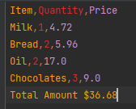

# 202-individual-project

## Introduction
This is a basic application that processes order and outputs success message into text file. If there are any error it
outputs into separate error.txt file.
This application gets csv file as command line argument to read order details. 

## Prerequisites

- [ ] Open JDK - [Openjdk 17](https://jdk.java.net/17/) is used as a JDK.

## Clone Project
- Project can be cloned from  [Github]( https://github.com/hrishikeshtele/202-individual-project).
- Make sure that you've sufficient rights / permissions to clone the project.

## Design Pattern
- Singleton Pattern: Singleton is a creational design pattern, which ensures that only one object of its kind exists and provides a single point of access to it for any other code.
Inventory List is single object which follows singleton design pattern as it serves as in-memory database.

- Composite Pattern: Composite is a structural design pattern that lets you compose objects into tree structures and then work with these structures as if they were individual objects.
Order class has List of OrderItem class. Where we can work with OrderItem as Individual object.

- Adapter Pattern: FileReader reads input files into Inventories and Order Class object.

## Build Project
- Clone the code from Git into a folder, lets call this ***project_root***

- Run below commands from ***project_root*** directory for various tasks.

```bash
cd out\production\main
```

```bash
java com.ht.shop.ShopApplication "Path for data.csv file" "Path for input.csv file" "Path for cards.csv file."
```

## UML Class Diagram 


## Success Output


## Error Output

